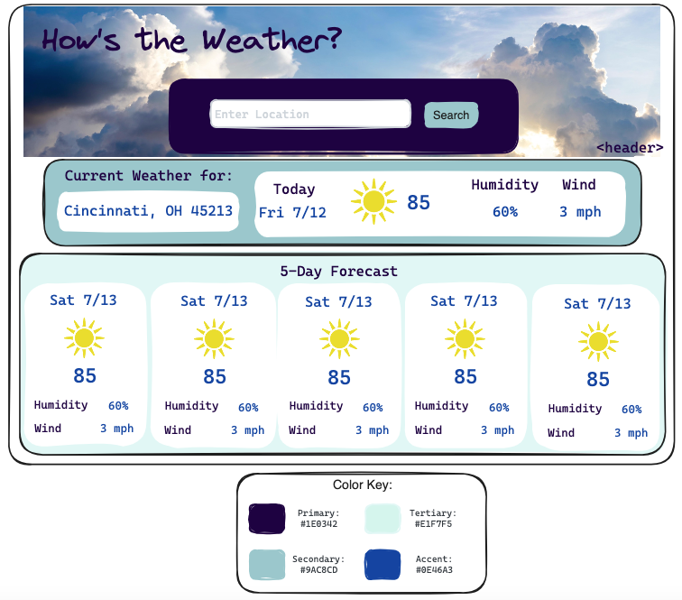
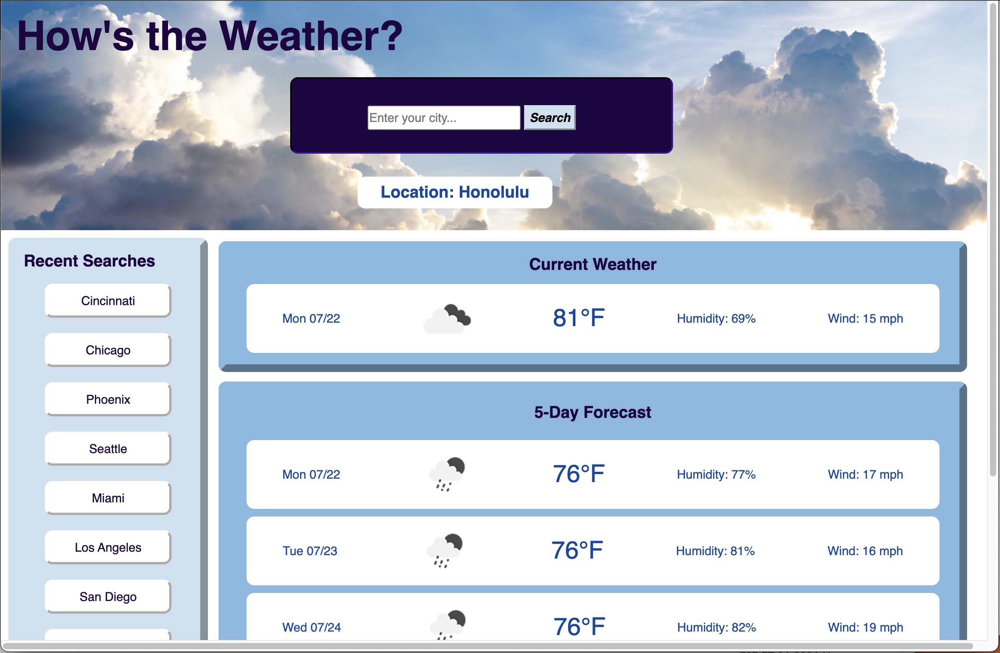
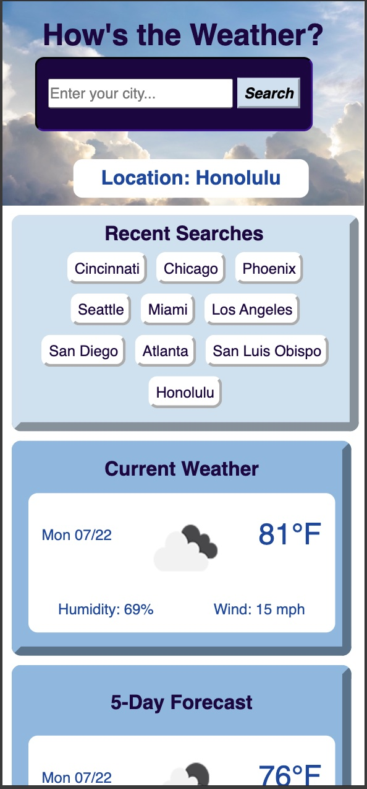

# hows-the-weather

My weather dashboard is deployed at: https://egodschalk.github.io/hows-the-weather/

The link to the GitHub repo for this project is: https://github.com/egodschalk/hows-the-weather

I created a wireframe for this application:

Screenshots of the application:

Desktop site

Mobile site
